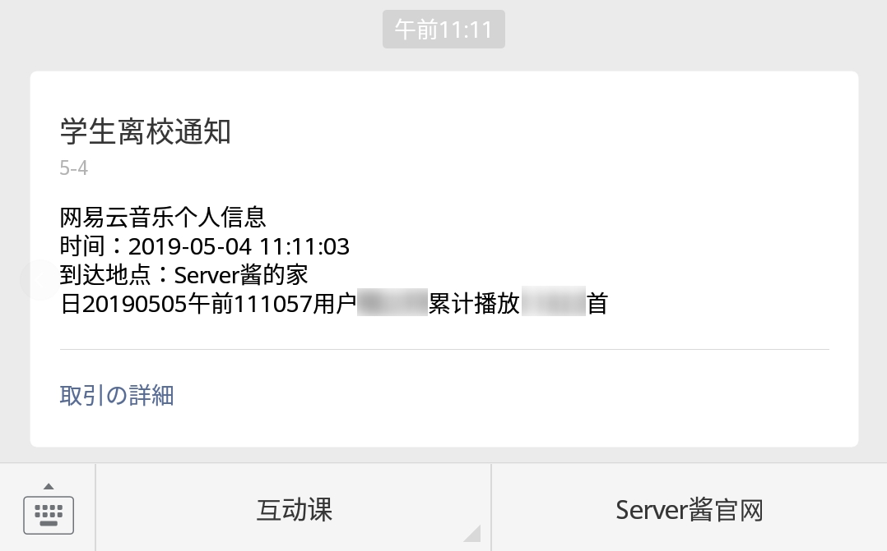

## NeteaseDataLevel

+ .net core搭建的控制台同步项目
+ 每天过点将网易云个人某信息转发到微信，需要获取 SCKEY 和绑定微信。


### 开发环境
+ .net core sdk 2.2.203

### 使用到的依赖库添加
```bash
dotnet add package Aiursoft.Pylon
```

### 运行
```bash
# 开发使用库要求 sdk 在 2.2 以上
cd NeteaseDataLevel
rm bin obj -rf
dotnet build NeteaseDataLevel.csproj

dotnet bin/Debug/netcoreapp2.2/NeteaseDataLevel.dll
```

### 注意事项
+ From [Server酱](http://sc.ftqq.com/3.version)
> + 每人每天发送上限500条，相同内容5分钟内不能重复发送，~~不同内容10秒内不能连续发送~~ 不同内容一分钟只能发送30条。主要是防止程序出错的情况。
> + 由于很多死循环请求导致服务器费用飙升，24小时请求接口超过1000次的账户将被封禁。

### 参考文档
+ [NeteaseCloudMusicApi](https://github.com/Binaryify/NeteaseCloudMusicApi)
+ [NeteaseMuiscApi](https://github.com/GEEKiDoS/NeteaseMuiscApi)
+ http://sc.ftqq.com/3.version